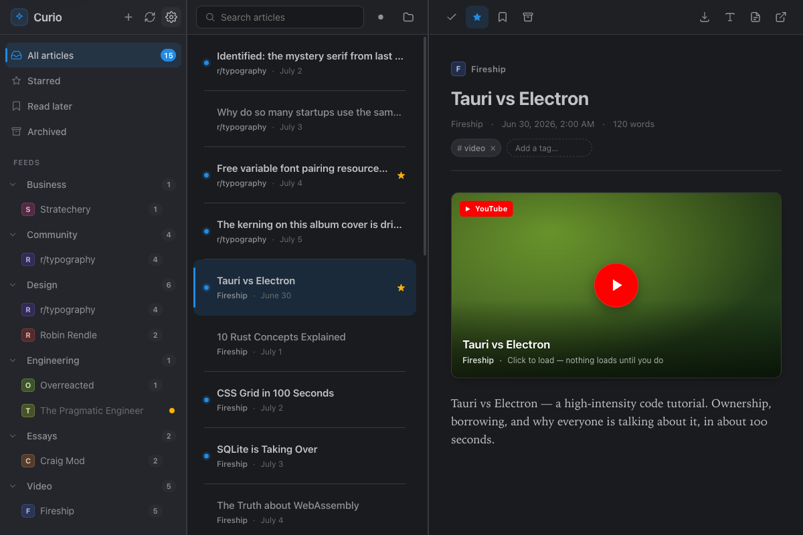
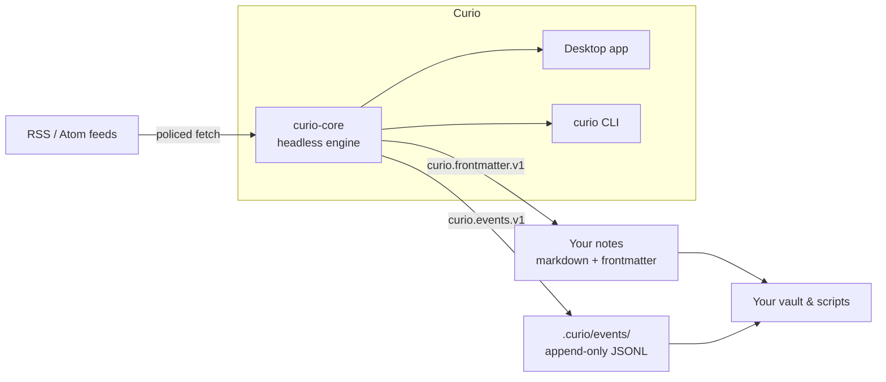
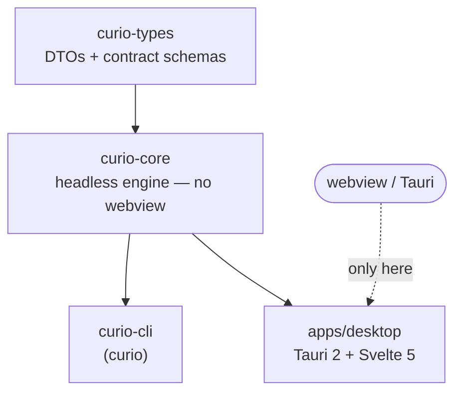

# Curio

[](https://github.com/alexnodeland/curio-rss/actions/workflows/ci.yml)
[](https://github.com/alexnodeland/curio-rss/releases)
[](#license)


> **v0.3.0** — a reading-and-refinement release: new reader typography controls
> (weight, letter-spacing, hyphenation) and **Sepia / Paper reading themes**,
> keyboard feed reordering, drag a feed out of a folder, search-term
> highlighting, `mailto:` / `tel:` links, honest cold-start feed health, and
> localized plurals across all eight languages. (See the
> [changelog](CHANGELOG.md) for the full list; v0.2.0 brought right-click menus,
> folders, tabbed settings, source presets, background refresh, and the in-app
> updater.)
> **Website:** <https://alexnodeland.github.io/curio-rss/> ·
> Changelog: [CHANGELOG.md](CHANGELOG.md) ·
> Roadmap: [docs/design/roadmap.md](docs/design/roadmap.md).



Curio is a **local-first reader** — RSS/Atom feeds and read-later — that
treats your notes as the destination, not a silo. It exports what you read
into your own directories as **plain markdown** with typed YAML frontmatter,
and records how you read as an **append-only behavioral event log** (JSONL)
your own tools can consume. It is the reading surface of a personal
knowledge plane: your vault and your scripts are first-class consumers, via
two small, versioned, published contracts:

- **`curio.frontmatter.v1`** — every saved article becomes a markdown note
  with machine frontmatter and a marked managed region; everything you add
  outside the region is preserved byte-for-byte on re-export.
- **`curio.events.v1`** — saved/starred/read-later/tagged/opened events as
  append-only JSONL under `.curio/events/`, never committed to git, built
  for replay by downstream consumers.

Spec: [docs/design/contracts-draft.md](docs/design/contracts-draft.md) ·
Artifacts: [schemas/](schemas/) ·
Privacy stance: [PRIVACY.md](PRIVACY.md) — no telemetry, no phone-home; the
only thing that leaves your machine is fetching the feeds you subscribed to.

> Curio is the reading surface of a personal knowledge plane: your vault and
> your scripts are first-class consumers, via two small, versioned, published
> contracts.

## Features

| | |
|---|---|
| 📥 **Subscribe & refresh** | RSS/Atom with URL autodiscovery, per-feed & bulk refresh, **background refresh on launch + a configurable interval**, health tracking + backoff |
| ➕ **Add anything** | Smart-input add — paste a URL, `r/subreddit`, `@user@instance` (Mastodon), a YouTube channel, or Hacker News; plus a Popular-sources quick-add row |
| 🗂️ **Organize** | Create / rename / delete folders, drag feeds **into and out of** folders, drag- or **keyboard-reorder (`Alt`+↑/↓)**, inline rename, keyboard tree navigation, right-click menus, an edit-feed panel (URL visible + health), and a warning dot on any feed whose last refresh errored — **honest from a cold start** |
| 📖 **Read** | Three-pane reader with **adjustable typography** (size, width, weight, line-height, letter-spacing, hyphenation) and **Sepia / Paper reading themes**, on-demand full-article readability, comfortable/compact list density, inline snippets, mark-on-open, opt-in mark-on-scroll, next-unread across feeds |
| ⭐ **State** | Read · star · read-later · archive — event-sourced with negation events |
| 🔎 **Search** | Full-text search over everything (SQLite FTS5), with **match highlighting** in results |
| ↔️ **Import / export** | OPML in/out + Pocket, Instapaper & Readwise CSV importers |
| 📝 **Save to notes** | Named destinations → markdown notes with a byte-preserved managed region |
| 🎨 **Appearance** | 9 built-in themes + System, **custom themes you export & import as YAML**, **Sepia / Paper reading themes** independent of the app theme, a rich live typography preview, RSS-native Reddit layout + **click-to-play YouTube** |
| 🔔 **Notifications** | Optional desktop notifications on new articles — per-event toggles, quiet hours, per-feed opt-out |
| 🔄 **Auto-updates** | Built-in "Check for updates" that installs & relaunches; auto-check / auto-install toggles; signed GitHub-release artifacts |
| ⌨️ **Keyboard & menus** | Native macOS menu bar, ⌘-chord hotkeys, vim-style keys, tooltips, and a help overlay |
| ♿ **Accessible** | Focus-trapped modals, listbox navigation, live-region toasts, WCAG-AA contrast (gated) |
| 🌍 **8 languages** | English · Español · Français · Deutsch · Italiano · Polski · 简体中文 · 廣東話 |
| 🔒 **Private** | No telemetry, no accounts; a per-host fetch policy (e.g. Reddit) is disclosed in [PRIVACY.md](PRIVACY.md); remote media & favicon fallback are opt-in |

## How your data flows



## Install (macOS)

The desktop app ships for macOS. Via Homebrew:

```sh
brew install --cask alexnodeland/tap/curio
```

or download the universal `Curio-universal.dmg` (Apple silicon **and** Intel)
from the [latest release](https://github.com/alexnodeland/curio-rss/releases/latest).

Curio is **not signed or notarized** (Apple Developer enrollment is
deliberately skipped — see [docs/design/decisions.md](docs/design/decisions.md)),
so Gatekeeper blocks it on first launch. Open it once via **right-click →
Open** (macOS 12–14) or **System Settings → Privacy & Security → Open Anyway**
(macOS 15+), or clear the quarantine flag:

```sh
xattr -dr com.apple.quarantine "/Applications/Curio.app"
```

After first launch Curio keeps itself current — **Settings → General → Check
for updates**, or let it auto-check. Updates are downloaded, signature-verified,
and installed in place from the GitHub release feed, then relaunch on a click.

Windows and Linux bundles are built nightly and downloadable as CI artifacts,
but are not a shipped channel yet.

## Keyboard shortcuts

Curio is keyboard-first — press <kbd>?</kbd> in the app for the always-current
list. A native macOS **menu bar** exposes the same actions (and their
command-key chords).

| Key | Action | | Key | Action |
|-----|--------|-|-----|--------|
| <kbd>j</kbd> / <kbd>k</kbd> | Next / previous article | | <kbd>s</kbd> | Star |
| <kbd>n</kbd> | Next unread (across feeds) | | <kbd>l</kbd> | Read-later |
| <kbd>m</kbd> | Mark read / unread | | <kbd>a</kbd> | Archive |
| <kbd>o</kbd> | Open in browser | | <kbd>p</kbd> | Save to notes |
| <kbd>g</kbd> then <kbd>a</kbd>/<kbd>s</kbd>/<kbd>l</kbd>/<kbd>e</kbd> | Go to All / Starred / Read-later / Archived | | <kbd>?</kbd> | Keyboard reference |

Move between panes with the arrow keys (<kbd>←</kbd>/<kbd>→</kbd> across panes,
<kbd>↑</kbd>/<kbd>↓</kbd> within one), and reorder a feed inside its folder with
<kbd>Alt</kbd>+<kbd>↑</kbd>/<kbd>↓</kbd>.

macOS command chords (also in the menu bar):
<kbd>⌘N</kbd> Add feed · <kbd>⌘R</kbd> Refresh all · <kbd>⌘,</kbd> Settings ·
<kbd>⌘1</kbd>–<kbd>⌘4</kbd> All / Starred / Read-later / Archived.

## Importers

Bring your library over in one step (**Settings → Data → Import**):

| Source | Format | Imported as |
|--------|--------|-------------|
| OPML | `.opml` | Feed subscriptions (with folders) |
| Pocket | `.csv` | Read-later articles + tags |
| Instapaper | `.csv` | Read-later articles (folders → tags) |
| Readwise Reader | `.csv` | Read-later articles + tags |

## Command-line interface

Curio also ships a CLI over the same engine. From a clone,
`cargo install --path crates/curio-cli` (or run via `cargo run -p
curio-cli --`). Then:

```sh
curio init                                  # scaffold the profile: curio.toml, curio.db, events log
curio feed add https://example.com/feed.xml --tags rust
curio fetch                                 # refresh, report new-article counts
curio list --unread                         # what's waiting (--json on any read command)
curio show 3e9f10aa                         # rendered markdown in the terminal
curio star 3e9f10aa                         # …later/archive/tag/untag; every flip is an event
curio dest add vault ~/notes/reading        # name a destination directory once
curio save 3e9f10aa --dest vault            # export the note per curio.frontmatter.v1
curio events tail -n 5                      # watch the curio.events.v1 stream
curio doctor                                # db integrity, FTS sync, events-log health
```

Full command walkthrough + `curio.toml` format: [docs/cli.md](docs/cli.md).

Developing? From a clone:

```sh
just setup   # git hooks + tool checks (needs Rust stable, just, lefthook, cargo-deny, cargo-llvm-cov)
just ci      # fmt, clippy -D warnings, hermetic tests, cargo-deny, boundary check,
             # coverage floor (85% regions on curio-core), rustdoc -D warnings, blob guard,
             # frontend gates (biome/eslint/svelte-check, vitest, {@html}+invoke bans)
just         # list all recipes
```

No Node or npm required for engine work; the desktop head's Rust crate is
in the workspace (on Linux, `--workspace` builds need the webkit2gtk/gtk
system packages — see CONTRIBUTING.md), and the core itself stays headless.
Frontend work needs Node + `npm install` under `apps/desktop/` — the
frontend gates then ride `just ci`.

## Architecture

One Tauri-free engine crate, many thin heads:

| Crate | Role |
|-------|------|
| `crates/curio-core` | fetch, ingest, store, state, export, events — the whole engine |
| `crates/curio-types` | shared DTOs + the published contract schemas |
| `crates/curio-cli` | `curio`, the v1 head: agent/cron/scripting surface |
| `apps/desktop` | Tauri 2 + Svelte 5 reader — `curio-desktop`, the Phase 4 head (in the workspace) |



The boundary is mechanically enforced: `deny.toml` scopes the tauri bans so
only the desktop head may pull the webview, and CI proves curio-core's own
tree builds headless on a bare Linux runner. Full design: [docs/design/architecture.md](docs/design/architecture.md).

## Contributing

See [CONTRIBUTING.md](CONTRIBUTING.md) (dev setup, conventional commits,
hermetic-test rule), [SECURITY.md](SECURITY.md) for private vulnerability
disclosure, and [GOVERNANCE.md](GOVERNANCE.md).

## License

Licensed under either of

- Apache License, Version 2.0 ([LICENSE-APACHE](LICENSE-APACHE) or
  <http://www.apache.org/licenses/LICENSE-2.0>)
- MIT license ([LICENSE-MIT](LICENSE-MIT) or
  <http://opensource.org/licenses/MIT>)

at your option.

Unless you explicitly state otherwise, any contribution intentionally
submitted for inclusion in the work by you, as defined in the Apache-2.0
license, shall be dual licensed as above, without any additional terms or
conditions.
