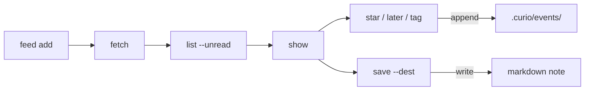

# `curio` — the CLI head

`curio` is the v1 surface of Curio: an agent-, cron-, and script-friendly
head over the `curio-core` engine. Every command is a thin adapter — the
fetch policy, sanitize-at-ingest pipeline, SQLite store, event log, and
export machinery all live in the core and behave identically under any
future head.

- Install: `cargo install --path crates/curio-cli`
- Every **read command takes `--json`** and then prints exactly one JSON
  document on stdout — parse, don't scrape.
- Diagnostics go to stderr, driven by `RUST_LOG` (e.g.
  `RUST_LOG=curio_core=debug curio fetch`).
- Errors exit non-zero with a one-line `error: …` on stderr.

## Commands at a glance

| Command | What it does |
|---------|--------------|
| `curio init [dir]` | Scaffold a profile (`curio.toml`, `curio.db`, events log) |
| `curio feed add <url> [--tags …]` | Subscribe (autodiscovers the feed on a site URL) |
| `curio feed list` / `curio feed rm <id>` | List / unsubscribe |
| `curio fetch` | Refresh every feed; reports new-article counts |
| `curio list [--unread\|--starred\|--tag …]` | List articles (keyset-paginated) |
| `curio show <id>` | Render an article as markdown in the terminal |
| `curio star` / `later` / `archive` / `tag` / `untag` `<id>` | Flip state — each is a `curio.events.v1` event |
| `curio search <query>` | Full-text search (FTS5) |
| `curio dest add <name> <path>` | Register a save destination |
| `curio save <id> --dest <name>` | Export a note per `curio.frontmatter.v1` |
| `curio events tail [-n N]` | Watch the behavioral event stream |
| `curio doctor` | DB integrity, FTS sync, events-log health |

A typical reading loop:



## The profile

All state lives in one profile directory:

| Path | Contents |
|------|----------|
| `curio.toml` | human-editable configuration (below) |
| `curio.db` | WAL SQLite: feeds, articles, state, FTS index |
| `.curio/events/events-YYYYMMDD.jsonl` | the `curio.events.v1` behavioral log |
| `.curio/.gitignore` | scaffolded so the events log is never committed |

The default location is the platform data directory —
`~/.local/share/curio` on Linux (XDG-respecting: `XDG_DATA_HOME` wins),
`~/Library/Application Support/curio` on macOS. Override per invocation
with `--profile DIR` or persistently with `CURIO_PROFILE=DIR`.

```sh
curio init                 # scaffold the default profile
curio --profile /tmp/p init  # or an explicit one (great for testing)
```

`init` is idempotent: re-running never clobbers an existing `curio.toml`.

## `curio.toml`

```toml
[settings]
default_destination = "vault"   # what `curio save` uses when --dest is omitted
politeness_delay_ms = 500       # min spacing between requests to the same host
user_agent = "curio/0.1"        # optional User-Agent override

[destinations]
vault = "/home/you/notes/reading"

[feeds."http://127.0.0.1:8787/digest.xml"]
allow_private_network = true    # contract W1 — see below
```

Ownership split: feeds, articles, and reading state live in `curio.db`
(the engine's domain — don't edit); `curio.toml` owns what a human should
be able to change with a text editor. On every run the CLI reconciles the
file into the engine: destinations are (re-)registered and per-feed
overrides are applied.

**Contract W1 (`allow_private_network`).** The fetch client is
SSRF-guarded by default: it refuses to touch loopback, RFC 1918, and
link-local addresses, re-checking every redirect hop after DNS
resolution. A per-feed `allow_private_network = true` exempts one feed —
so a localhost digest feed stays subscribable. The flag is *explicit
configuration only*: edit `curio.toml`, or pass
`--allow-private-network` to `feed add` (which writes it to `curio.toml`
for you). Nothing in feed content can ever set it.

## Feeds

```sh
curio feed add https://example.com/feed.xml --tags rust,databases
curio feed add http://127.0.0.1:8787/digest.xml --allow-private-network
curio feed list [--json]
curio feed rm example.com          # by id, exact URL, or unique substring
```

`feed add` emits `feed.added` (with the tags — tags-in-payload rule);
`feed rm` emits the `feed.removed` negation and keeps the articles.

```sh
curio fetch                 # refresh every active feed
curio fetch example.com     # or just one
```

`fetch` reports per-feed status and new/updated article counts. The
engine does conditional GET (ETag/Last-Modified preserved on every error
path), honors permanent redirects, auto-pauses a feed forever on HTTP 410,
and stores only sanitized content — raw feed HTML never reaches the
database.

```sh
curio opml import subscriptions.opml   # folders become tags; known URLs skipped
curio opml export backup.opml          # "-" writes to stdout
```

## Reading

```sh
curio list [--unread] [--starred] [--read-later] [--tag rust] [--feed example.com] [--limit 20]
curio search "sqlite wal" [--limit 20]    # real FTS5, hostile input escaped
curio show 3e9f10aa                       # article as markdown; marks it read
curio open 3e9f10aa                       # emits article.opened, launches $BROWSER
```

Article handles are **any unique fragment of the `curio_id`** — listings
show the 8-character tail, which is the typable handle. (UUIDv7 ids share
their leading timestamp bits within a fetch batch, so a leading prefix
needs to be much longer; use the tail.) Ambiguous or unknown fragments
fail with a helpful message.

`open` uses `$BROWSER` when set, else the platform opener (`open` /
`xdg-open`). The `article.opened` event is written first — the record is
the point.

## State

```sh
curio star 3e9f10aa      # article.starred          curio unstar …  # article.unstarred
curio later 3e9f10aa     # article.read_later.added curio unlater … # article.read_later.removed
curio archive 3e9f10aa   # article.archived         curio unarchive …
curio tag 3e9f10aa rust  # article.tagged           curio untag … rust
```

Every flip is idempotent: re-starring a starred article changes nothing
and emits nothing (`"changed": false` in JSON). Negation events remove
membership when the stream is folded — histories are not monotone, per
the events contract.

## Saving to destinations

A destination is a named directory of markdown + YAML — your notes vault,
a git repo, anything. Paths enter the system exactly once, at
registration; everything else refers to destinations by name.

```sh
curio dest add vault ~/notes/reading
curio dest list
curio save 3e9f10aa --dest vault     # or set settings.default_destination
```

`save` writes a `curio.frontmatter.v1` note (machine frontmatter + the
marked managed region) and updates the destination's
`.curio/manifest.json` — note first, manifest second, both via atomic
rename. Export is idempotent on `(curio_id, checksum)`:

- first save → `created`, emits `article.saved`
- content changed since → `updated`, emits `article.updated`, replaces
  only the frontmatter machine keys and the managed region — everything
  you wrote outside the markers survives byte-for-byte
- unchanged → `unchanged`, writes nothing, emits nothing

## Events

```sh
curio events tail -n 20 [--json]
```

A debug view of the `curio.events.v1` stream: with `--json` you get the
envelopes exactly as they appear on disk (ULID `event_id`, millisecond
UTC `ts`, `type` + `payload`). Consumers should read the files directly —
`.curio/events/events-YYYYMMDD.jsonl`, append-only, rotated daily or at
50 MB, retained ≥ 90 days — and dedupe by `event_id`. See
[design/contracts-draft.md](design/contracts-draft.md) for the full
contract and [../schemas/](../schemas/) for the machine-readable schemas.

## Doctor

```sh
curio doctor [--json]
```

Health probes over the durable surfaces, exit code 1 if any fail:
schema version, `PRAGMA integrity_check`, FTS5-index/content sync,
events-log parseability, the events `.gitignore` scaffold, and staged
event intents (a non-empty set means a crash interrupted emission; the
next open replays them).
