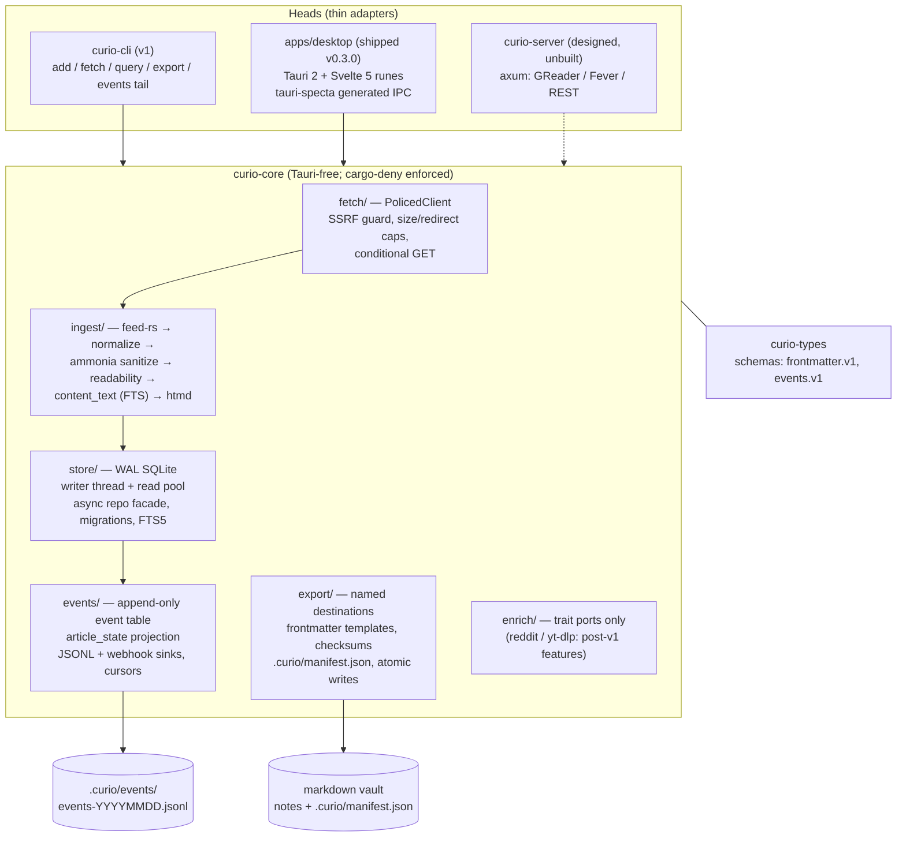

# Curio architecture — core-plus-heads

Curio is a production-grade, local-first RSS reader + read-later system. This document
distills the winning design from the planning workflow (see
[research/designs.json](research/designs.json), design "core-plus-heads", selected 3-for-3
across the OSS-adoption, maintenance, and product lenses in
[research/verdicts.json](research/verdicts.json)). The authoritative published contracts
live in [contracts-draft.md](contracts-draft.md); resolved trade-offs are recorded in
[decisions.md](decisions.md); the build plan is [roadmap.md](roadmap.md).

## The shape

The product is **`curio-core`** — a Tauri-free Rust library crate owning the entire
reading engine. Every user-facing surface is a thin **head** over the same
`Arc<CurioCore>` service object:

| Component | Role | Status |
|-----------|------|--------|
| `crates/curio-core` | The engine: fetch, ingest, store, state, export, events | v1 |
| `crates/curio-types` | DTO + schema crate; schemars → published JSON Schema artifacts | v1 |
| `crates/curio-cli` | **The v1 head.** Agent/cron/scripting surface; daily CI proof the core is headless | v1 |
| `apps/desktop` | Tauri 2 + Svelte 5 (runes) reader — the surface users judge | **Shipped — v0.3.0** (macOS universal DMG; `brew install --cask …/curio`). The Phase-4 reader, the v0.2 polish round (context menus, tabbed settings, background refresh, notifications, source presets, a native menu bar, in-app updater), and the v0.3 reading-and-refinement round (reader typography controls + Sepia/Paper themes, keyboard feed reorder, search highlighting, localized plurals) |
| `curio-server` | axum daemon: GReader/Fever + REST over the same crate | **designed, unbuilt** — a design doc only, never an in-tree stub |

The boundary is mechanically enforced, not review-policed: `cargo-deny` bans `tauri` from
every crate except the desktop head (`wrappers`-scoped since Phase 4 moved the boundary),
`cargo run -p xtask -- boundary` checks `curio-core`'s own tree, and the CLI head's
headless build breaks CI the day the core stops compiling without a webview. This is what makes both futures — a server head
speaking GReader/Fever to the existing mobile-client ecosystem, or a sync-client mode into
FreshRSS/Miniflux — cheap ports against proven seams rather than rewrites.



## curio-core, module by module

### `fetch/` — the policy-hardened client

One mandatory `PolicedClient` for **all** outbound requests (feeds, favicons, images):

- **SSRF guard by default**: deny-resolve loopback/RFC1918/link-local after DNS
  resolution; redirects re-checked per hop (cap 5). Per-feed
  `allow_private_network = true` (explicit config edit only, never settable from feed
  content) exempts a feed — the W1 allowlist in the contract, kept so localhost digest
  feeds stay subscribable.
- Streaming-enforced size caps, connect/total timeouts, shared pooled client, and an
  honest default User-Agent — overridden by a **per-host fetch policy** (a browser UA +
  a longer politeness delay, on the platform-native TLS stack) for hosts that reject the
  default, so sources like Reddit's `.rss` fetch. Still RSS-native, not enrichment; every
  UA/delay class is disclosed in PRIVACY.md.
- Conditional GET with `etag`/`last_modified` **preserved on error paths** (the sketch
  clobbered them on any failure).
- Permanent-redirect stored-URL updates; 410 dead-feed auto-pause; feed-health tracking.

### `ingest/` — sanitize-at-ingest

The pipeline stores only clean content; raw feed HTML never reaches the DB:

```text
feed-rs parse → normalize (dedupe guid → link → hash(title+published),
                date fallbacks, xml:base) → ammonia sanitize → readability
              → content_text extraction (FTS is real) → htmd DOM-walk CommonMark
```

This kills the sketch's stored-XSS chain at the root and fixes full-text search being a
silent no-op in the same pass. The desktop head's strict CSP + capabilities are
defense-in-depth, not the primary defense.

### `store/` — WAL SQLite behind an async facade

- WAL mode + `busy_timeout`; a **dedicated writer thread** (channel-fed, all mutations
  transactional, batch `INSERT..ON CONFLICT`) plus an **N-connection read pool** used via
  `spawn_blocking`. Heads never see `rusqlite` — the facade is the one place
  async-over-sync is handled, so the blocking-in-async bug class cannot recur in head code.
- Articles get an `INTEGER PRIMARY KEY` rowid alias with **UUIDv7** as a unique column —
  stable FTS5 external-content mapping and insert locality at 100k rows.
- Numbered embedded migrations: transactional, forward-only, automatic pre-migration
  backup; tested against fixture DBs from every released version.
- Escaped FTS5 query builder (never raw `MATCH`); keyset pagination everywhere; counts
  computed in SQL.
- Network-filesystem guard: refuses to open the DB on Syncthing/iCloud/NFS-class mounts
  without an explicit override flag.

### `events/` — event-sourced article state

Every state change (`saved`/`read`/`starred`/`read_later`/`archived`/`tagged`/…) appends
to an append-only events table; current state (`article_state`) is a projection in the
same transaction. One mechanism serves three masters:

1. Correct, replayable UI state (retention can never orphan it; read flips never churn FTS).
2. The published `curio.events.v1` JSONL stream (a filtered replay with cursor
   checkpointing, daily rotation, file + webhook sinks).
3. The substrate for any future sync — server head, client mode, or file-based journal
   merge — as a deterministic merge problem instead of a retrofit.

Cursor semantics are designed now (`events since <cursor>`) so the JSONL export, `curio
events tail`, and a future server head's `GET /v1/events?since=` share one cursor.
Envelope, event types, negation rule (ULID `event_id`, tags-in-payload, non-monotone
histories) are fixed by [contracts-draft.md](contracts-draft.md).

### `export/` — the strategic seam

A "vault" is any configured directory of Markdown + YAML — generic, never
Obsidian-branded. Per article: sanitized HTML → htmd CommonMark → templated
`curio.frontmatter.v1` YAML (identity `curio_id` UUIDv7; `checksum` as change token
**only**), wrapped in the managed-region markers so re-export never touches user content
outside the region.

- **Named destinations only**: promotion is always "promote article X to destination
  NAME" — raw filesystem paths never cross IPC or CLI flags. Every write canonicalizes
  and asserts containment.
- **Idempotency manifest dual-homed**: SQLite table + in-vault `.curio/manifest.json`
  (sorted keys, mergeable diffs), so a wiped-and-reinstalled Curio pointed at an existing
  vault reconciles instead of re-duplicating.
- **Write ordering**: note first, manifest second, both via temp-file + atomic rename —
  a crash leaves an orphan note, never a dangling manifest entry. Vaults are assumed
  git-/watcher-observed mid-write.
- Export is idempotent on `(curio_id, checksum)`: unchanged → no write.

### `enrich/` — trait ports, zero providers in v1

`Enricher` traits exist from day one; Reddit-JSON and yt-dlp providers are post-v1 cargo
features. **yt-dlp is never bundled** — external binary, pinned version + SHA256
verification, `--`-separated argv, strict URL validation. v1 ships reddit/youtube view
*layouts* over RSS-native data only.

## The heads

**`curio-cli` (v1).** `add / fetch / query / search / export / events tail / opml`, plus
`curio export --all` (the full-portability archive: OPML + events JSONL + settings +
read-later). It is simultaneously the agent/cron surface, the second-machine seeding
story, and the daily CI job proving the core boundary holds.

**`apps/desktop` (shipped — v0.3.0).** Deliberately thin: dozens of `#[tauri::command]` wrappers
delegating to `Arc<CurioCore>` with zero business logic. IPC types are 100% generated by
tauri-specta (committed, CI-diffed; hand-written `invoke()` lint-banned) — the sketch's
snake_case/error-shape drift class becomes unrepresentable. Strict CSP, per-window
capabilities, no shell plugin, URL-scoped opener, a single sanitized-render component
wrapping every `{@html}`. Svelte 5 runes state layer on the ported CSS token system;
backend-owned counts/filtering/sorting; virtualized lists; keyboard-first shortcut
registry.

**`curio-server` (designed, unbuilt).** Lives as a design note only, so nothing unshipped
has to keep compiling. When built, it exposes GReader/Fever + REST over the same crate —
the pre-paid down-payments are the head-agnostic core and the shared events cursor.

## Published contracts

`curio-types` publishes two versioned, semver'd surfaces (JSON Schema artifacts +
human-readable docs) that become public API the moment one external consumer exists —
and the Knowledge Plane is consumer #1, wired by configuration only:

- **`curio.frontmatter.v1`** — exported markdown notes: machine frontmatter keys +
  a marked managed content region; `.curio/manifest.json` as the export-idempotency oracle.
- **`curio.events.v1`** — the append-only reading-behavior JSONL feed: ULID event ids,
  negation events, tags-in-payload, rotation/retention/cursor rules. Never committed to git.

Schema files are versioned-immutable: a breaking change mints `*.v2.json`, never edits v1
semantics. See [contracts-draft.md](contracts-draft.md) — where the old sketch code
disagrees with it, the contract wins.

## What v1 is honest about

No sync of any kind: single-machine desktop + CLI over one SQLite file. What crosses
devices is exactly the promoted vault (via whatever syncs it — git, Syncthing) and the
event stream. The two credible future answers — the server head and GReader/Fever client
mode — are named seams, not v1 commitments; file-based journal merge (per-device
append-only ULID event journals, set-union + LWW) is the named serverless direction.
